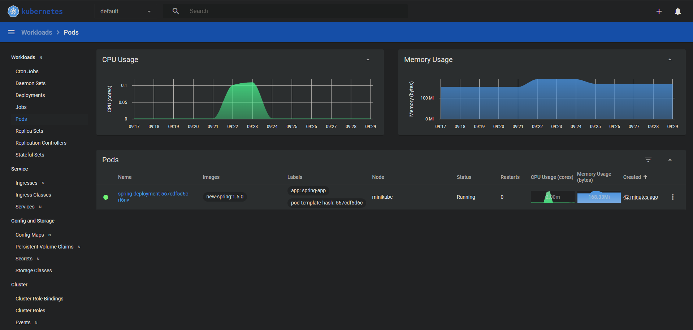
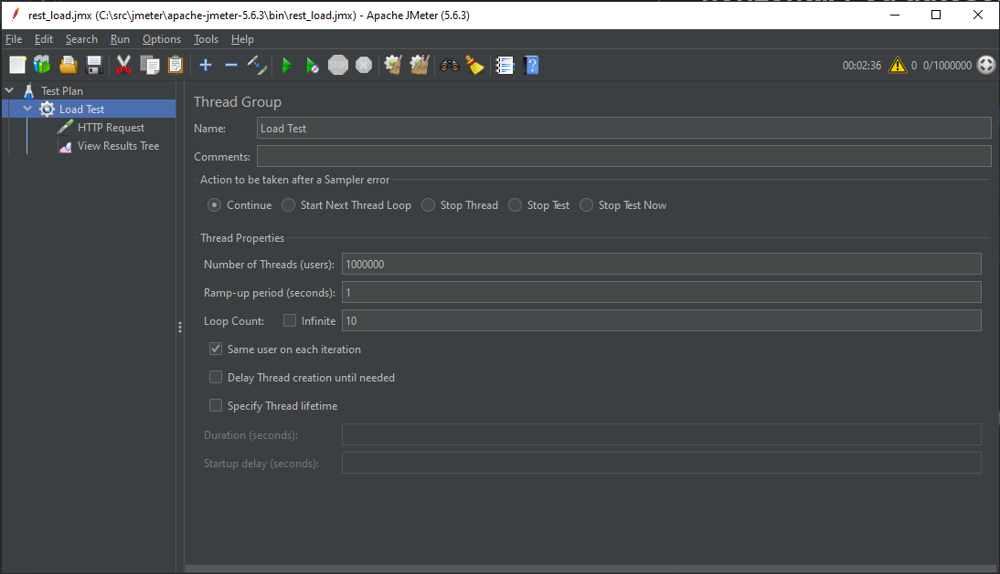
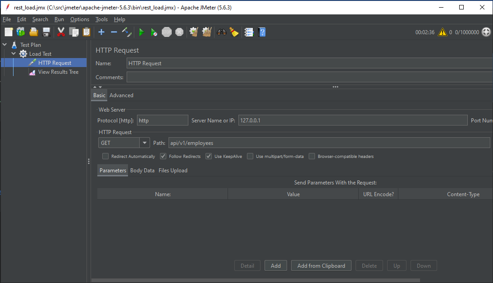
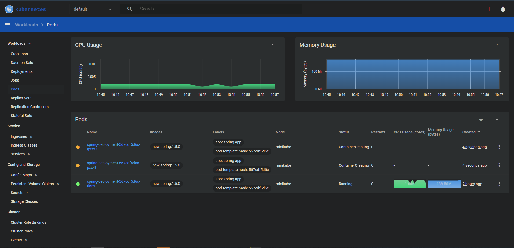
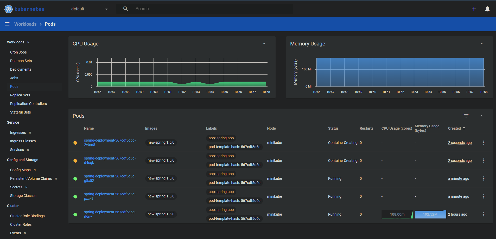
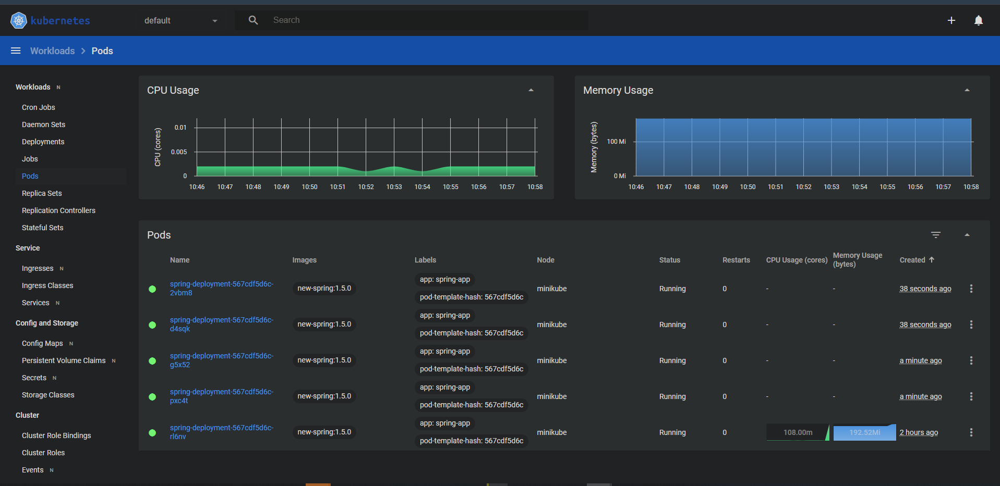
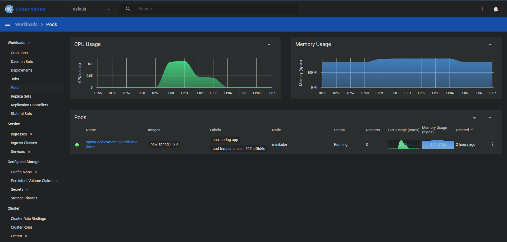

# This is a sample k8s configuration for horizontal Pod autoscaling.

## 1. Without any load.



## 2. Let's apply some load with JMeter.

<h6 style="text-align: center;">Image 1` (setup number of request)`</h6>


<h6 style="text-align: center;">Image 2` (provide the Http request)`</h6>


##  3. View the k8s pod changes when increasing the load.

```yaml
apiVersion: autoscaling/v2
kind: HorizontalPodAutoscaler
metadata:
  name: spring-api
spec:
  minReplicas: 1
  maxReplicas: 5
  metrics:
    - resource:
        name: cpu
        target:
          averageUtilization: 20
          type: Utilization
      type: Resource
  scaleTargetRef:
    apiVersion: apps/v1
    kind: Deployment
    name: spring-deployment #This should be the relevant deployment name
```

<h6 style="text-align: center;">Image 3` (1 running, other 2 containerCreating state)`</h6>



<h6 style="text-align: center;">Image 4` (3 running, other 2 containerCreating state)`</h6>


<h6 style="text-align: center;">Image 5` (All pods are perfectly running)`</h6>


<h6 style="text-align: center;">Image 5` (After running the load falling back to minimum replicas)`</h6>
